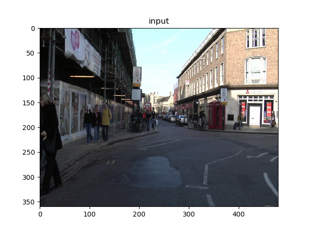
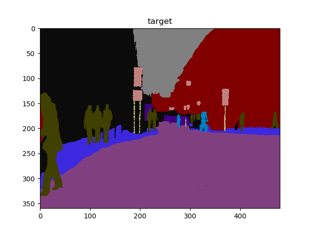
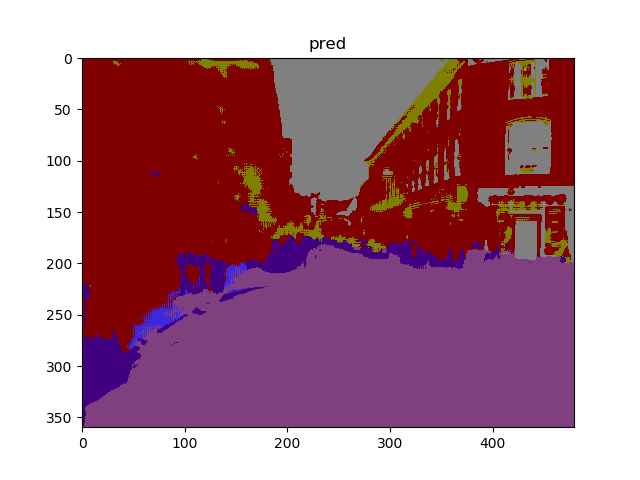
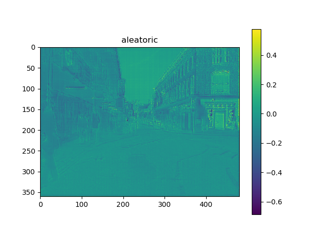
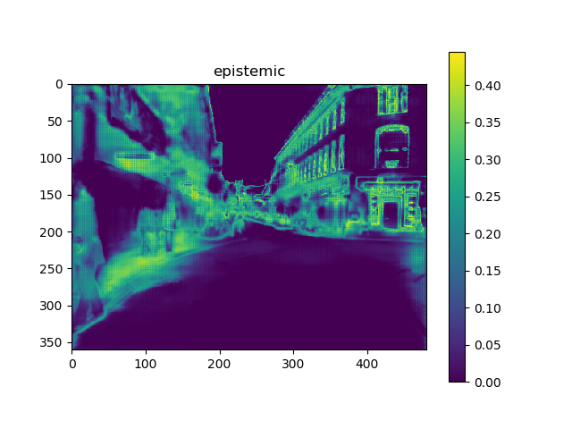

# Uncertainty_with_Camvid

Pytorch implementation of ['what uncertainties do we need in bayesian deep learning for computer vision'](https://arxiv.org/abs/1703.04977).


## Dataset


- http://mi.eng.cam.ac.uk/research/projects/VideoRec/CamVid/

- https://github.com/alexgkendall/SegNet-Tutorial/tree/master/CamVid

## Requirements

- torchvision==0.3.0

- torch=1.1.0
- numpy=1.15.2
- tensorflow=1.14.0
- matplotlib


## Usage

**Train**: check hyperparamer.py

```python
python train.py
```

**Visualize**: check the saved weight path.
```python
python visualize.py
```


## Results

|              | <center>baseline57</center> | <center>Combined57</center> |
| ------------ | ------------------------- | ------------------------- |
| val_error |         0.379225346534653 | 0.325735643564356 |

- Input

  

- Target

  

- Prediction

  

- Aleatoric uncertainty

  

- Epistemic uncertainty

  
  
  


## Blog

https://rroundtable.github.io/post/2019-06-29-what-uncertainties-do-we-need-in-bayesian-deep/


## Reference

- baseline: https://github.com/bfortuner/pytorch_tiramisu

  

